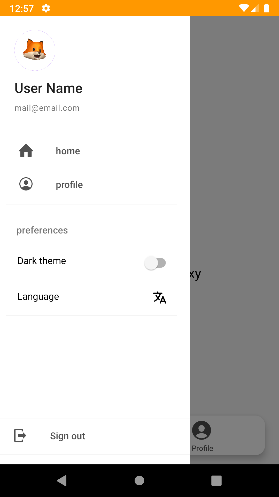

# ReactNative-Starter-Kit
Simple base project with cool features and Foxy theme🦊


<div align="center">
  
</div>

## Visuals
<div align="center">
  
  
  
  
  
  
</div>

## Features

- Well-designed clean file structure
- React native paper for UI
- Dark theme compatibility
- Multi language (defualt English,Persian. you can add more)
- Multi font support
- Image picking/selecting support
- React Navigation V5 (stack, drawer, bottom and switch navigations)
- Splash screen

## Getting Started

#### 1. Clone and Install

```bash
# Clone the repo

git clone https://github.com/salehafzoon/ReactNative-Starter-Kit.git

# Navigate to clonned folder and rename project

cd ReactNative-Starter-Kit && npx react-native-rename <newName>

# Install dependencies by use of **yarn** or **npm**

yarn install
# or
npm install
```

#### 2 Start it on Android simulator

Run this command in main directory to start your app on Android simulator:
```
react-native run-android
```


## Contributing

Pull requests are welcome. ```npm run test``` and ```npm run lint``` before push.
